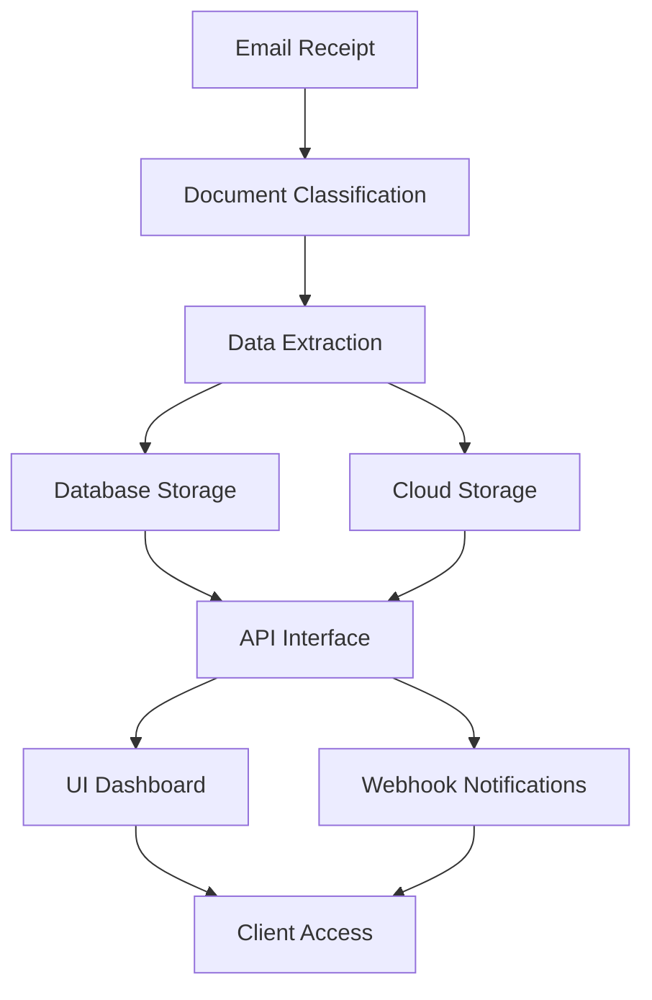
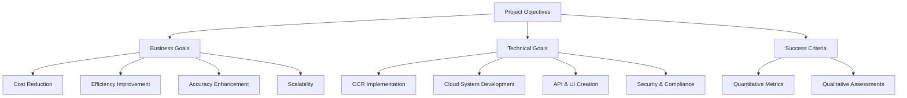
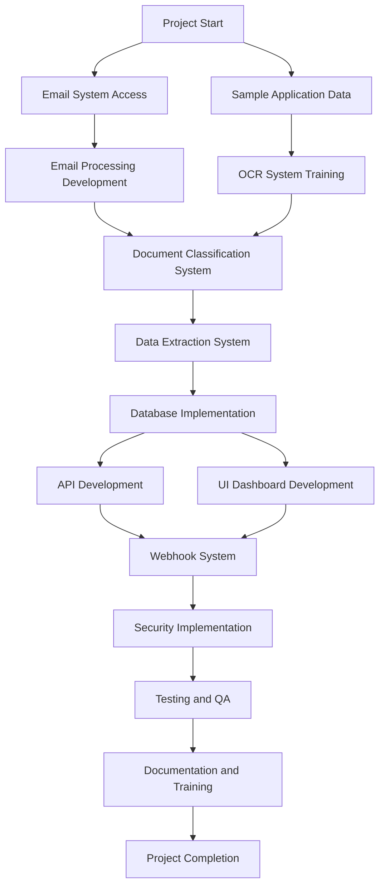
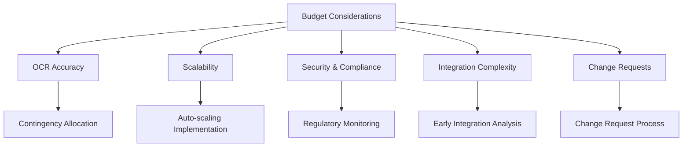
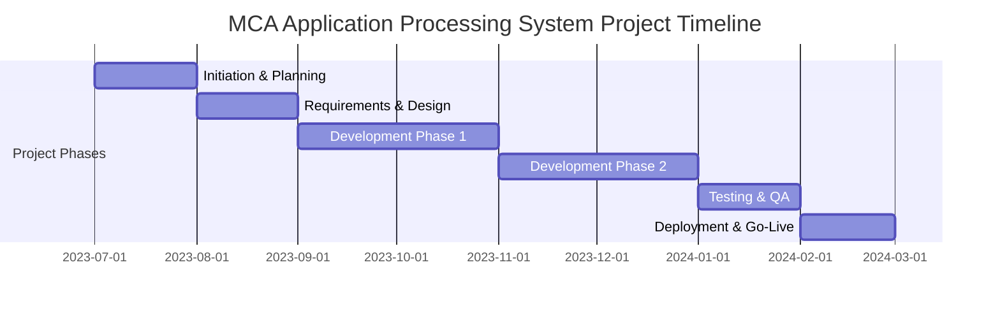
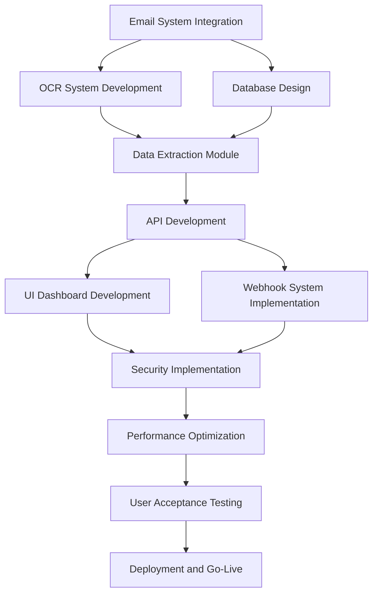
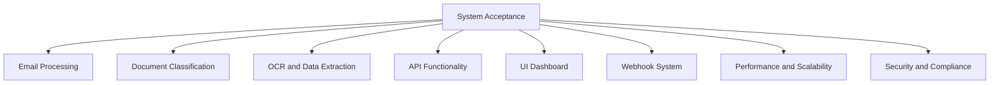

## EXECUTIVE SUMMARY

### PROJECT OVERVIEW

Dollar Funding, a Merchant Cash Advance (MCA) provider, seeks to revolutionize their application processing system by implementing a cloud-based solution. This project aims to automate the manual data entry process for MCA applications, which are currently received via email and processed by a team of 30 employees. The proposed solution will digitize and streamline the entire workflow, from email receipt to data extraction and client notification.

The system will:
1. Process incoming emails and attachments
2. Extract and classify relevant information from PDF documents
3. Store data securely in a database and cloud storage
4. Provide API and UI interfaces for client interaction
5. Implement webhook notifications for real-time updates

This automation will significantly reduce manual labor, increase efficiency, and improve accuracy in processing MCA applications.

### OBJECTIVES

1. Automate 93% of manual data entry work, replacing 28 out of 30 current staff members
2. Implement a state-of-the-art OCR solution capable of handling imperfect and handwritten applications
3. Develop a secure, scalable, and highly available cloud-based system
4. Create user-friendly API and UI interfaces for seamless client interaction
5. Establish a robust webhook system for real-time application status updates
6. Ensure compliance with data privacy and security regulations

### VALUE PROPOSITION

Our agency offers a unique combination of expertise and innovation to deliver a cutting-edge solution for Dollar Funding:

1. Specialized OCR Technology: Our advanced OCR solution is tailored to handle the complexities of MCA applications, including handwritten and imperfectly scanned documents.

2. End-to-End Automation: We provide a comprehensive solution that covers the entire workflow, from email processing to data extraction and client notification.

3. Scalability and Reliability: Our cloud-based architecture ensures the system can handle increasing workloads while maintaining high availability.

4. Customized Integration: We offer both API and UI interfaces, allowing seamless integration with Dollar Funding's existing systems and processes.

5. Cost-Effective Solution: By automating 93% of manual data entry, we significantly reduce operational costs and improve overall efficiency.

6. Ongoing Support and Maintenance: Our team provides continuous support to ensure the system remains up-to-date and performs optimally.

This value proposition positions our agency as the ideal partner to transform Dollar Funding's MCA application processing, driving efficiency and growth in their business operations.

## PROJECT OBJECTIVES

### BUSINESS GOALS

1. Automate 93% of manual data entry work, reducing operational costs by replacing 28 out of 30 current staff members
2. Increase processing speed and efficiency of MCA applications by at least 80%
3. Improve accuracy of data extraction and classification to 99.9%
4. Enhance scalability to handle a 200% increase in application volume without additional resources
5. Reduce application processing time from an average of 2 days to 2 hours
6. Improve client satisfaction by providing real-time updates and faster application processing

### TECHNICAL GOALS

1. Implement a state-of-the-art OCR solution capable of handling imperfect and handwritten applications with 99% accuracy
2. Develop a secure, scalable, and highly available cloud-based system with 99.99% uptime
3. Create a RESTful API for seamless integration with client systems and third-party applications
4. Design and implement a user-friendly UI dashboard for easy access to application information and system management
5. Establish a robust webhook system for real-time application status updates
6. Implement secure cloud storage for application attachments with role-based access control
7. Develop a flexible database schema to accommodate future expansion of data fields and application types
8. Ensure compliance with data privacy and security regulations (e.g., GDPR, CCPA)

### SUCCESS CRITERIA

| Criterion | Target | Measurement Method |
|-----------|--------|---------------------|
| Manual data entry reduction | 93% | Comparison of staff headcount before and after implementation |
| Application processing speed | 80% improvement | Average time from email receipt to data extraction completion |
| Data extraction accuracy | 99.9% | Random sampling and manual verification of processed applications |
| System uptime | 99.99% | Monitoring logs and downtime reports |
| Application volume handling | 200% increase | Stress testing and performance monitoring during peak loads |
| Client satisfaction | 95% satisfaction rate | Post-implementation survey and feedback analysis |
| API response time | < 200ms for 95% of requests | API performance monitoring and logging |
| UI dashboard load time | < 2 seconds | Frontend performance testing and user experience feedback |
| Webhook notification delivery | 99.9% success rate | Webhook delivery logs and error tracking |
| Data privacy compliance | 100% adherence | Regular audits and compliance checks |

This comprehensive set of objectives and success criteria will guide the development and implementation of the cloud-based MCA application processing system for Dollar Funding, ensuring that both business and technical goals are met while providing clear metrics for measuring project success.

## SCOPE OF WORK

### IN-SCOPE

1. Email Processing System
   - Develop an automated system to monitor and process emails received at submissions@dollarfunding.com
   - Extract and store email metadata (sender, body, subject, etc.) in a database
   - Track application status (Processing, Ready, Failed)

2. Document Classification and Storage
   - Implement an AI-powered document classification system for PDF attachments
   - Categorize documents as ISO applications, bank statements, or voided checks
   - Develop a secure cloud storage system for classified documents with role-based access control

3. Advanced OCR Solution
   - Implement a state-of-the-art OCR system capable of processing imperfect and handwritten applications
   - Extract text information from ISO applications with high accuracy
   - Identify and extract key merchant details, funding information, and owner data

4. Database Design and Implementation
   - Design and implement a scalable database schema to store extracted application data
   - Ensure data integrity and compliance with privacy regulations

5. API Development
   - Create a RESTful API for client integration
   - Implement endpoints for application retrieval, webhook management, and system status checks

6. UI Dashboard
   - Develop a user-friendly web-based dashboard for application management
   - Include features for viewing application information, attachments, and webhook management

7. Webhook Notification System
   - Implement a robust webhook system for real-time application status updates
   - Develop functionality for clients to register, edit, and remove webhooks

8. Security and Compliance
   - Implement industry-standard security measures for data protection
   - Ensure compliance with relevant data privacy regulations (e.g., GDPR, CCPA)

9. Scalability and High Availability
   - Design and implement a cloud-based architecture for scalability and high availability
   - Ensure the system can handle a 200% increase in application volume

10. Testing and Quality Assurance
    - Conduct thorough testing of all system components
    - Perform stress testing and performance optimization

11. Documentation and Training
    - Provide comprehensive system documentation
    - Conduct training sessions for Dollar Funding staff on system usage and management

### OUT-OF-SCOPE

1. Hardware procurement or on-premises infrastructure setup
2. Integration with Dollar Funding's internal systems beyond the provided API and webhook interfaces
3. Development of mobile applications for system access
4. Customization of the OCR system for documents other than MCA applications and related attachments
5. Data migration from Dollar Funding's existing systems
6. Ongoing content moderation or manual review of processed applications
7. Development of additional email processing capabilities beyond submissions@dollarfunding.com
8. Creation of custom reporting tools outside the provided UI dashboard
9. Integration with third-party CRM or ERP systems
10. Provision of legal advice regarding compliance with financial regulations

### ASSUMPTIONS

1. Dollar Funding will provide timely access to necessary information and resources required for the project
2. The client will assign a dedicated point of contact for project coordination and decision-making
3. Dollar Funding's email system can be configured to allow our solution to access the submissions@dollarfunding.com inbox
4. The volume of applications will not exceed a 200% increase from current levels during the initial implementation phase
5. Third-party OCR and cloud services will remain available and maintain their current level of functionality
6. Dollar Funding will handle any necessary internal process changes to accommodate the new system
7. The client will provide a representative set of sample applications for testing and training the OCR system
8. Dollar Funding will be responsible for obtaining any necessary regulatory approvals for implementing the new system
9. The client's existing internet infrastructure can support the increased data transfer requirements of the new system
10. Dollar Funding will handle the transition and potential reallocation of the 28 staff members being replaced by the system

### DEPENDENCIES

1. Email System Access: Timely configuration and access to the submissions@dollarfunding.com email account
2. Sample Application Data: Provision of a diverse set of sample MCA applications for system training and testing
3. Third-party OCR Service: Availability and reliability of the chosen OCR technology provider
4. Cloud Infrastructure: Selection and setup of the cloud platform (e.g., AWS, Azure, Google Cloud) for system deployment
5. Database Technology: Selection and licensing of appropriate database technology for the project requirements
6. Security Certificates: Timely acquisition of necessary security certificates for API and UI access
7. Compliance Verification: Confirmation of compliance requirements from Dollar Funding's legal team
8. User Acceptance Criteria: Clear definition of acceptance criteria for each project phase from Dollar Funding
9. Integration Points: Specification of any required integration points with Dollar Funding's existing systems
10. Performance Benchmarks: Establishment of clear performance benchmarks for system evaluation
11. Webhook Endpoints: Provision of webhook endpoint information from Dollar Funding for notification testing
12. Training Schedule: Coordination of training schedules with Dollar Funding's staff availability
13. Go-Live Approval: Final approval from Dollar Funding's management for system deployment and go-live

This scope of work outlines the key components, boundaries, assumptions, and dependencies for the MCA application processing system project for Dollar Funding. It provides a clear framework for project execution while allowing for necessary adjustments as the project progresses.

## BUDGET AND COST ESTIMATES

### COST BREAKDOWN

The following table provides a detailed breakdown of the project costs:

| Category | Item | Cost (USD) |
|----------|------|------------|
| Labor | Project Manager (800 hours @ $150/hr) | 120,000 |
| Labor | Senior Software Engineers (3000 hours @ $120/hr) | 360,000 |
| Labor | UI/UX Designer (400 hours @ $100/hr) | 40,000 |
| Labor | QA Specialist (600 hours @ $90/hr) | 54,000 |
| Labor | DevOps Engineer (400 hours @ $110/hr) | 44,000 |
| Software | OCR Solution License (Annual) | 50,000 |
| Software | Cloud Services (Est. for development and first year) | 60,000 |
| Software | Database License (If applicable) | 20,000 |
| Hardware | Development and Testing Equipment | 15,000 |
| Miscellaneous | Training and Documentation | 20,000 |
| Miscellaneous | Contingency (10% of total) | 78,300 |
| **Total** |  | **861,300** |

### PAYMENT SCHEDULE

The proposed payment schedule is tied to project milestones:

| Milestone | Percentage | Amount (USD) | Due Date |
|-----------|------------|--------------|----------|
| Project Kickoff | 20% | 172,260 | Upon contract signing |
| Requirements Finalization | 10% | 86,130 | End of Month 1 |
| Design Approval | 15% | 129,195 | End of Month 2 |
| Development Phase 1 Completion | 20% | 172,260 | End of Month 4 |
| Development Phase 2 Completion | 15% | 129,195 | End of Month 6 |
| Testing and QA Completion | 10% | 86,130 | End of Month 7 |
| System Deployment and Go-Live | 5% | 43,065 | End of Month 8 |
| Final Acceptance | 5% | 43,065 | 30 days after Go-Live |

### BUDGET CONSIDERATIONS

Several factors could impact the budget and require careful management:

1. OCR Accuracy Optimization: 
   - Risk: Additional time and resources may be needed to achieve the required 99% accuracy for handwritten and imperfect applications.
   - Mitigation: Allocate part of the contingency budget for potential OCR fine-tuning and optimization.

2. Scalability Requirements:
   - Risk: The need to handle a 200% increase in application volume may require additional cloud resources.
   - Mitigation: Implement auto-scaling features and monitor usage closely during the first months of operation.

3. Security and Compliance:
   - Risk: Evolving data privacy regulations may require additional security measures.
   - Mitigation: Stay informed about regulatory changes and allocate resources for potential security enhancements.

4. Integration Complexity:
   - Risk: Unforeseen challenges in integrating with Dollar Funding's email system or existing processes.
   - Mitigation: Conduct a thorough analysis of integration points early in the project and adjust timelines if necessary.

5. Change Requests:
   - Risk: Client may request additional features or changes to the scope.
   - Mitigation: Implement a clear change request process with associated cost implications.

To manage these considerations:

1. Maintain open communication with Dollar Funding about potential budget impacts.
2. Conduct regular budget reviews and adjust allocations as needed.
3. Utilize the contingency fund strategically to address unforeseen challenges.
4. Prioritize features and optimize development processes to stay within budget constraints.
5. Document all budget-related decisions and their rationale for transparency.

By carefully managing these budget considerations and maintaining flexibility, we can ensure the successful delivery of the MCA application processing system within the proposed budget framework.

## TIMELINE AND MILESTONES

### PROJECT TIMELINE

The project is estimated to take 8 months from initiation to completion. Here's a high-level timeline outlining the major phases:

### KEY MILESTONES

| Milestone | Description | Target Date |
|-----------|-------------|-------------|
| M1: Project Kickoff | Project initiation, team assembly, and initial planning | 2023-07-01 |
| M2: Requirements Finalization | Completion of detailed requirements gathering and documentation | 2023-07-31 |
| M3: Design Approval | Approval of system architecture, database schema, and UI/UX designs | 2023-08-31 |
| M4: Development Phase 1 Completion | Completion of core functionalities (email processing, OCR, data extraction) | 2023-10-31 |
| M5: Development Phase 2 Completion | Completion of API, UI dashboard, and webhook system | 2023-12-31 |
| M6: Testing and QA Completion | Successful completion of all testing phases, including performance and security testing | 2024-01-31 |
| M7: System Deployment | Successful deployment of the system to production environment | 2024-02-15 |
| M8: Go-Live and Final Acceptance | System goes live and final client acceptance is obtained | 2024-02-29 |

### CRITICAL PATH

The following tasks and activities are critical to keeping the project on schedule:

1. Email System Integration: Early access and integration with Dollar Funding's email system is crucial for development and testing of the email processing module.

2. OCR System Development and Training: The advanced OCR system is a core component and requires significant development and training time to achieve the required accuracy.

3. Database Design and Implementation: The database schema needs to be finalized early as it impacts multiple components of the system.

4. API Development: The API serves as the backbone for both internal system communication and client integration, making it a critical component.

5. Security Implementation: Security measures must be implemented throughout the development process to ensure compliance and data protection.

6. Performance Optimization: Ensuring the system can handle the required volume of applications is critical for meeting scalability requirements.

7. User Acceptance Testing: Timely feedback and approval from Dollar Funding during UAT is crucial for meeting the go-live date.

Maintaining focus on these critical path items and ensuring their timely completion will be essential for the overall success of the project. Regular monitoring and proactive management of these tasks will help mitigate risks and keep the project on track for its scheduled completion.

## DELIVERABLES

### LIST OF DELIVERABLES

1. Cloud-Based MCA Application Processing System
   - Email Processing Module
   - Document Classification System
   - Advanced OCR Solution
   - Data Extraction and Storage System
   - RESTful API
   - UI Dashboard
   - Webhook Notification System

2. System Documentation
   - System Architecture Documentation
   - API Documentation
   - User Manual for UI Dashboard
   - Database Schema Documentation
   - Deployment Guide

3. Training Materials
   - User Training Guide
   - Administrator Training Guide
   - Video Tutorials for UI Dashboard and API Usage

4. Testing and Quality Assurance
   - Test Plans
   - Test Cases
   - Test Results Report
   - Performance Test Results

5. Security and Compliance Documentation
   - Security Audit Report
   - Data Privacy Compliance Report

### DELIVERY SCHEDULE

| Deliverable | Expected Delivery Date |
|-------------|------------------------|
| System Architecture Documentation | End of Month 1 |
| Database Schema Documentation | End of Month 2 |
| Email Processing Module | End of Month 3 |
| Document Classification System | End of Month 3 |
| Advanced OCR Solution | End of Month 4 |
| Data Extraction and Storage System | End of Month 4 |
| RESTful API (Initial Version) | End of Month 5 |
| UI Dashboard (Initial Version) | End of Month 5 |
| Webhook Notification System | End of Month 6 |
| API Documentation | End of Month 6 |
| User Manual for UI Dashboard | End of Month 6 |
| Test Plans and Cases | End of Month 6 |
| RESTful API (Final Version) | End of Month 7 |
| UI Dashboard (Final Version) | End of Month 7 |
| Security Audit Report | End of Month 7 |
| Data Privacy Compliance Report | End of Month 7 |
| Test Results Report | End of Month 7 |
| Performance Test Results | End of Month 7 |
| User Training Guide | End of Month 8 |
| Administrator Training Guide | End of Month 8 |
| Video Tutorials | End of Month 8 |
| Deployment Guide | End of Month 8 |

### ACCEPTANCE CRITERIA

1. Cloud-Based MCA Application Processing System

   a. Email Processing Module
   - Successfully processes 100% of incoming emails from submissions@dollarfunding.com
   - Accurately extracts and stores email metadata (sender, body, subject)
   - Correctly tracks application status (Processing, Ready, Failed)

   b. Document Classification System
   - Accurately classifies at least 95% of PDF attachments (ISO applications, bank statements, voided checks)
   - Stores classified documents in the designated secure cloud storage

   c. Advanced OCR Solution
   - Achieves 99% accuracy in text extraction from ISO applications, including handwritten and imperfectly scanned documents
   - Correctly identifies and extracts all required merchant details, funding information, and owner data

   d. Data Extraction and Storage System
   - Stores extracted data in the database with 100% accuracy and consistency
   - Maintains data integrity and complies with privacy regulations

   e. RESTful API
   - Provides all specified endpoints for application retrieval, webhook management, and system status checks
   - Achieves an average response time of <200ms for 95% of requests under normal load
   - Handles concurrent requests as per specified performance requirements

   f. UI Dashboard
   - Displays all required information (application details, attachments, webhook management)
   - Achieves a user satisfaction rating of at least 4 out of 5 in usability tests
   - Loads within 2 seconds on standard broadband connections

   g. Webhook Notification System
   - Successfully delivers 99.9% of notifications within 5 seconds of trigger events
   - Allows clients to register, edit, and remove webhooks without errors

   h. Performance and Scalability
   - Handles a 200% increase in application volume without degradation in performance
   - Maintains 99.99% uptime during normal operations

   i. Security and Compliance
   - Passes all specified security tests and audits
   - Complies fully with relevant data privacy regulations (e.g., GDPR, CCPA)

2. System Documentation
   - Comprehensive coverage of all system components and functionalities
   - Clear, concise, and technically accurate content
   - Includes all diagrams, flowcharts, and examples as necessary
   - Passes review by technical and non-technical stakeholders

3. Training Materials
   - Covers all aspects of system usage for both regular users and administrators
   - Includes hands-on exercises and real-world scenarios
   - Video tutorials are clear, concise, and cover all major system functionalities
   - Achieves a minimum 90% satisfaction rate in post-training surveys

4. Testing and Quality Assurance
   - Test plans cover all system functionalities and edge cases
   - Test cases are comprehensive and reproducible
   - Test results report clearly identifies any issues and their resolutions
   - Performance test results demonstrate compliance with specified performance requirements

5. Security and Compliance Documentation
   - Security audit report identifies no critical vulnerabilities
   - Data privacy compliance report confirms adherence to all relevant regulations
   - Both reports are validated by Dollar Funding's legal and compliance teams

Final acceptance of the project will be granted when all individual deliverables meet their specified acceptance criteria, and the system as a whole demonstrates the ability to process MCA applications with the efficiency and accuracy required to replace 28 out of 30 current staff members in the data entry team.