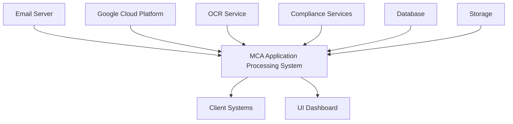
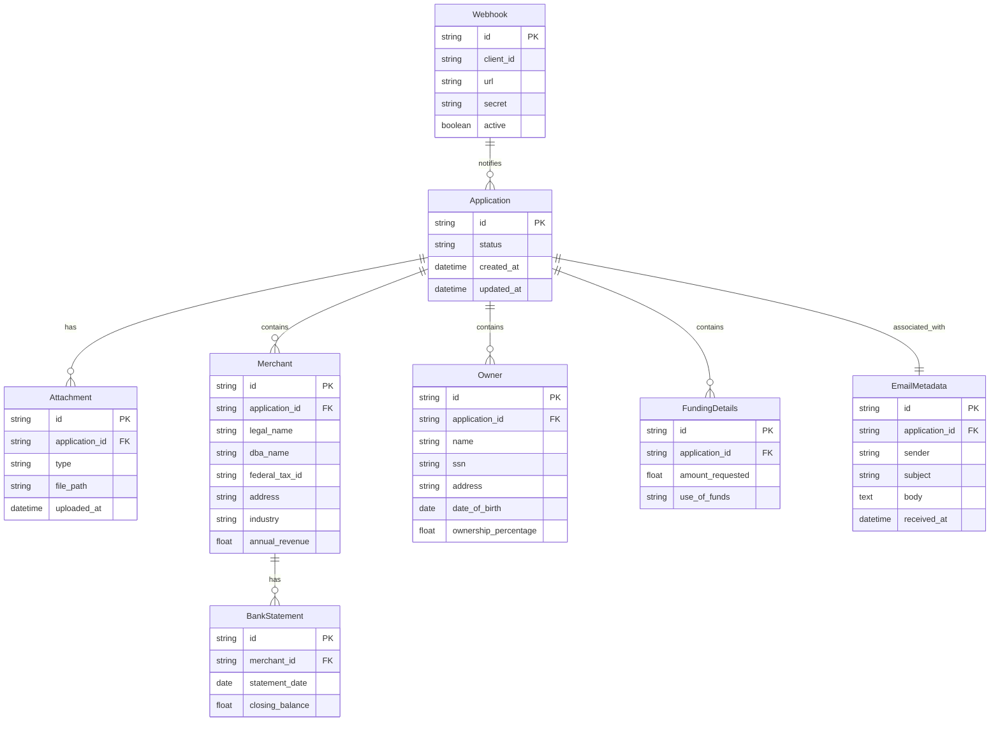
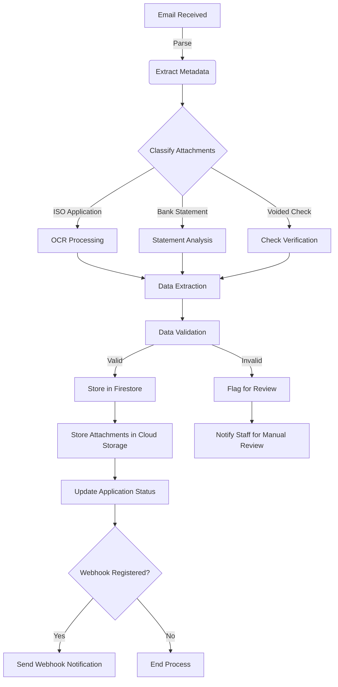

## INTRODUCTION

### PURPOSE

The purpose of this Software Requirements Specification (SRS) document is to provide a comprehensive and detailed description of the cloud-based Merchant Cash Advance (MCA) application processing system for Dollar Funding. This document serves as the primary reference for the development team, project stakeholders, and quality assurance personnel throughout the software development lifecycle.

The intended audience for this SRS includes:

1. Development Team: Software engineers, UI/UX designers, and DevOps specialists responsible for implementing the system.
2. Project Managers: To guide project planning, resource allocation, and timeline management.
3. Quality Assurance Team: For developing test plans and ensuring the system meets specified requirements.
4. Dollar Funding Stakeholders: To review and approve the proposed solution and its functionalities.
5. Maintenance and Support Teams: For future reference in system maintenance and upgrades.

This document aims to establish a clear understanding of the system's requirements, functionalities, and constraints, ensuring alignment between all parties involved in the project.

### SCOPE

The cloud-based MCA application processing system for Dollar Funding is a comprehensive solution designed to automate and streamline the processing of Merchant Cash Advance applications. This system will revolutionize Dollar Funding's current manual process, significantly reducing the need for human data entry and improving overall efficiency.

High-level overview of the software product:

1. Goals:
   - Automate 93% of manual data entry work, replacing 28 out of 30 current staff members
   - Increase processing speed and accuracy of MCA applications
   - Provide a scalable and highly available solution to handle growing application volumes
   - Ensure data security and compliance with relevant regulations

2. Benefits:
   - Significant reduction in operational costs
   - Faster application processing times, improving customer satisfaction
   - Increased accuracy in data extraction and classification
   - Improved scalability to handle business growth
   - Enhanced data security and regulatory compliance
   - Real-time application status updates for clients

3. Core Functionalities:
   a. Email Processing:
      - Monitor and process emails received at submissions@dollarfunding.com
      - Extract and store email metadata
      - Track application status

   b. Document Classification and Storage:
      - Classify PDF attachments (ISO applications, bank statements, voided checks)
      - Securely store classified documents in Google Cloud Storage

   c. Advanced OCR and Data Extraction:
      - Implement state-of-the-art OCR to process imperfect and handwritten applications
      - Extract key information from ISO applications, including merchant details, funding information, and owner data

   d. Database Management:
      - Store extracted application data in a scalable database (Google Cloud Firestore)
      - Ensure data integrity and compliance with privacy regulations

   e. API Development:
      - Create a RESTful API using Python and Flask for client integration
      - Implement endpoints for application retrieval, webhook management, and system status checks

   f. UI Dashboard:
      - Develop a user-friendly web-based dashboard using React and Tailwind CSS
      - Display application information, attachments, and webhook management features

   g. Webhook Notification System:
      - Implement a robust webhook system for real-time application status updates
      - Allow clients to register, edit, and remove webhooks

   h. Security and Compliance:
      - Implement industry-standard security measures using Google Cloud security features
      - Ensure compliance with data privacy regulations (e.g., GDPR, CCPA)

The system will be built using modern technologies and best practices, including Python for backend services, React and Tailwind CSS for the UI, and leveraging the Google Cloud ecosystem for infrastructure and services. This comprehensive solution will enable Dollar Funding to process MCA applications more efficiently, accurately, and securely, positioning them for future growth and success in the industry.

## PRODUCT DESCRIPTION

### PRODUCT PERSPECTIVE

The cloud-based Merchant Cash Advance (MCA) application processing system for Dollar Funding is a comprehensive solution designed to automate and streamline the processing of MCA applications. This system will operate within the following context:

1. Email Integration: The system will interface with Dollar Funding's email server to monitor and process incoming applications sent to submissions@dollarfunding.com.

2. Cloud Infrastructure: The entire system will be built on the Google Cloud Platform (GCP), leveraging various GCP services for scalability, reliability, and security.

3. External Services Integration:
   - OCR Service: Integration with a state-of-the-art OCR solution for processing imperfect and handwritten applications.
   - Compliance Services: Integration with external compliance checking services to ensure adherence to financial regulations.

4. Client Systems: The system will provide APIs and webhooks for integration with Dollar Funding's existing internal systems and potential third-party applications used by clients.

5. User Interfaces: A web-based UI dashboard will be provided for Dollar Funding staff to manage and monitor the application processing workflow.



### PRODUCT FUNCTIONS

The MCA application processing system will perform the following main functions:

1. Email Processing:
   - Monitor the submissions@dollarfunding.com inbox
   - Extract email metadata and attachments
   - Initiate the application processing workflow

2. Document Classification:
   - Analyze and categorize PDF attachments (ISO applications, bank statements, voided checks)
   - Store classified documents in Google Cloud Storage

3. Advanced OCR and Data Extraction:
   - Perform OCR on application documents, including handwritten and imperfect scans
   - Extract key information such as merchant details, funding information, and owner data
   - Validate extracted data for completeness and accuracy

4. Data Management:
   - Store extracted application data in Google Cloud Firestore
   - Manage application status and processing history

5. API Services:
   - Provide RESTful API endpoints for application retrieval and management
   - Support webhook registration and management for real-time notifications

6. User Interface:
   - Present a web-based dashboard for application monitoring and management
   - Display application details, attachments, and processing status
   - Provide webhook management interface

7. Notification System:
   - Send real-time notifications via webhooks for application status updates
   - Alert staff when manual review is required (e.g., missing SSN or federal tax ID)

8. Security and Compliance:
   - Implement role-based access control for system functions
   - Ensure data encryption at rest and in transit
   - Maintain audit logs for all system activities

### USER CHARACTERISTICS

The system is designed to cater to the following user types:

1. Data Entry Specialists (2 remaining staff members):
   - Expertise: Moderate to high in MCA application processing
   - Responsibilities: Handling complex cases, manual reviews, and system oversight
   - Technical Skills: Basic to intermediate computer skills, familiarity with web applications

2. MCA Underwriters:
   - Expertise: High in MCA risk assessment and approval processes
   - Responsibilities: Reviewing processed applications, making funding decisions
   - Technical Skills: Intermediate computer skills, experience with financial software

3. IT Administrators:
   - Expertise: High in IT systems and cloud infrastructure
   - Responsibilities: System maintenance, security management, and performance monitoring
   - Technical Skills: Advanced technical skills, experience with Google Cloud Platform

4. Management:
   - Expertise: High in MCA business processes and operations
   - Responsibilities: Overseeing application processing, analyzing performance metrics
   - Technical Skills: Basic to intermediate, focused on using the UI dashboard for reporting

5. API Integrators:
   - Expertise: High in software development and API integration
   - Responsibilities: Integrating the MCA processing system with other internal or external systems
   - Technical Skills: Advanced programming skills, experience with RESTful APIs

### CONSTRAINTS

1. Regulatory Compliance:
   - Must adhere to financial regulations such as GDPR, CCPA, and industry-specific requirements

2. Performance:
   - System must process applications within 2 hours on average
   - API response times must be under 200ms for 95% of requests

3. Scalability:
   - Must handle a 200% increase in application volume without significant performance degradation

4. Accuracy:
   - OCR and data extraction must achieve 99% accuracy, including for handwritten applications

5. Integration:
   - Must integrate with Dollar Funding's existing email system and any required internal systems

6. Security:
   - Must implement industry-standard security measures and pass security audits

7. User Interface:
   - Dashboard must be compatible with modern web browsers and load within 2 seconds

8. Budget:
   - Development and implementation must be completed within the allocated budget of $861,300

9. Timeline:
   - Project must be completed within the 8-month timeframe

### ASSUMPTIONS AND DEPENDENCIES

Assumptions:

1. Dollar Funding will provide timely access to necessary information and resources
2. The volume of applications will not exceed a 200% increase from current levels during initial implementation
3. Dollar Funding's email system can be configured to allow access to the submissions@dollarfunding.com inbox
4. The client will handle any necessary internal process changes to accommodate the new system
5. Dollar Funding will provide a representative set of sample applications for testing and training the OCR system

Dependencies:

1. Google Cloud Platform services availability and performance
2. Chosen OCR service's accuracy and availability
3. Timely provision of necessary security certificates and access credentials
4. Availability of Dollar Funding staff for user acceptance testing and training
5. Stability of third-party libraries and frameworks used in development (React, Tailwind CSS, Python libraries)
6. Timely approval and decision-making from Dollar Funding stakeholders at key project milestones
7. Compliance with any new or updated financial regulations that may come into effect during the project timeline
8. Successful integration with any required external compliance checking services
9. Availability of reliable internet connectivity for cloud-based operations

This product description provides a comprehensive overview of the MCA application processing system, its context, main functions, intended users, constraints, and key assumptions and dependencies. It serves as a foundation for detailed requirements specification and system design in the subsequent phases of the project.

Here's the PROCESS FLOWCHART section for the SRS using Mermaid JS, consistent with the previously mentioned technologies and choices:

## PROCESS FLOWCHART

The following flowchart illustrates the high-level process flow of the MCA application processing system:

```mermaid
graph TD
    A[Email Received] -->|submissions@dollarfunding.com| B(Email Processing Module)
    B --> C{Attachments Present?}
    C -->|Yes| D[Document Classification]
    C -->|No| E[Mark for Manual Review]
    D --> F[OCR and Data Extraction]
    F --> G{Extraction Successful?}
    G -->|Yes| H[Store Data in Database]
    G -->|No| E
    H --> I[Update Application Status]
    I --> J{Manual Review Required?}
    J -->|Yes| K[Notify Staff for Review]
    J -->|No| L[Trigger Webhook Notification]
    K --> M[Staff Reviews Application]
    M --> N{Review Complete?}
    N -->|Yes| O[Update Application Status]
    N -->|No| K
    O --> L
    L --> P[Client Receives Notification]
    P --> Q[Client Accesses UI Dashboard]
    Q --> R[View Application Details]
    R --> S{Further Action Needed?}
    S -->|Yes| T[Client Takes Action]
    S -->|No| U[End Process]
    T --> V[Update Application via API]
    V --> I
```

This flowchart outlines the main steps in the MCA application processing system:

1. Email Reception: The process begins when an email is received at submissions@dollarfunding.com.

2. Email Processing: The Email Processing Module extracts metadata and checks for attachments.

3. Document Classification: If attachments are present, they are classified (ISO application, bank statements, etc.).

4. OCR and Data Extraction: The advanced OCR solution extracts data from the classified documents.

5. Data Storage: Successfully extracted data is stored in the database (Google Cloud Firestore).

6. Application Status Update: The system updates the application status based on the extraction results.

7. Manual Review: If required (e.g., missing information), staff is notified to review the application.

8. Webhook Notification: Once processing is complete, a webhook notification is sent to the client.

9. Client Interaction: The client can view application details through the React and Tailwind CSS-based UI dashboard.

10. Further Actions: If needed, the client can take actions or update the application using the RESTful API.

This process ensures efficient handling of MCA applications, from initial receipt to client notification, with provisions for manual intervention when necessary. The system leverages Python for backend processes and TypeScript, React, and Tailwind CSS for the user interface, as specified in the project requirements.

Here's a breakdown of the product features with the requested sub-sections:

1. Email Processing System

ID: F001
DESCRIPTION: Automated system to monitor and process emails received at submissions@dollarfunding.com, extract metadata, and initiate the application processing workflow.
PRIORITY: High

| Requirement ID | Requirement Description |
|----------------|--------------------------|
| F001-1 | Monitor submissions@dollarfunding.com inbox in real-time |
| F001-2 | Extract email metadata (sender, subject, body, timestamp) |
| F001-3 | Identify and extract PDF attachments |
| F001-4 | Store email metadata and status in Google Cloud Firestore |
| F001-5 | Trigger document classification process for attachments |

2. Document Classification System

ID: F002
DESCRIPTION: AI-powered system to classify PDF attachments as ISO applications, bank statements, or voided checks, and store them securely.
PRIORITY: High

| Requirement ID | Requirement Description |
|----------------|--------------------------|
| F002-1 | Analyze PDF content to determine document type |
| F002-2 | Classify documents with 95% accuracy |
| F002-3 | Store classified documents in Google Cloud Storage |
| F002-4 | Implement role-based access control for document storage |
| F002-5 | Trigger OCR process for classified documents |

3. Advanced OCR Solution

ID: F003
DESCRIPTION: State-of-the-art OCR system capable of processing imperfect and handwritten applications with high accuracy.
PRIORITY: Critical

| Requirement ID | Requirement Description |
|----------------|--------------------------|
| F003-1 | Perform OCR on classified documents with 99% accuracy |
| F003-2 | Handle imperfect scans and handwritten text |
| F003-3 | Extract key information from ISO applications |
| F003-4 | Identify merchant details, funding information, and owner data |
| F003-5 | Output extracted data in a structured format for database storage |

4. Data Management System

ID: F004
DESCRIPTION: System to store and manage extracted application data in a scalable and secure database.
PRIORITY: High

| Requirement ID | Requirement Description |
|----------------|--------------------------|
| F004-1 | Design and implement scalable database schema in Google Cloud Firestore |
| F004-2 | Store extracted application data securely |
| F004-3 | Implement data validation and error handling |
| F004-4 | Provide data retrieval and update capabilities |
| F004-5 | Ensure compliance with data privacy regulations |

5. RESTful API

ID: F005
DESCRIPTION: API for client integration, providing endpoints for application retrieval, webhook management, and system status checks.
PRIORITY: High

| Requirement ID | Requirement Description |
|----------------|--------------------------|
| F005-1 | Develop RESTful API using Python and Flask |
| F005-2 | Implement authentication and authorization for API access |
| F005-3 | Create endpoints for application data retrieval |
| F005-4 | Provide webhook registration and management endpoints |
| F005-5 | Implement system status and health check endpoints |

6. UI Dashboard

ID: F006
DESCRIPTION: User-friendly web-based dashboard for application management, displaying application information, attachments, and webhook management features.
PRIORITY: Medium

| Requirement ID | Requirement Description |
|----------------|--------------------------|
| F006-1 | Develop responsive UI using React and Tailwind CSS |
| F006-2 | Implement user authentication and role-based access control |
| F006-3 | Display application information and status |
| F006-4 | Provide attachment viewing capabilities |
| F006-5 | Implement webhook management interface |

7. Webhook Notification System

ID: F007
DESCRIPTION: Robust system for sending real-time application status updates to clients via webhooks.
PRIORITY: Medium

| Requirement ID | Requirement Description |
|----------------|--------------------------|
| F007-1 | Implement webhook event generation for application status changes |
| F007-2 | Develop webhook delivery system with retry mechanism |
| F007-3 | Provide webhook registration and management for clients |
| F007-4 | Implement security measures for webhook payloads |
| F007-5 | Create webhook delivery logs and monitoring system |

8. Security and Compliance System

ID: F008
DESCRIPTION: Comprehensive security measures and compliance checks to ensure data protection and regulatory adherence.
PRIORITY: Critical

| Requirement ID | Requirement Description |
|----------------|--------------------------|
| F008-1 | Implement end-to-end encryption for data in transit and at rest |
| F008-2 | Develop role-based access control across all system components |
| F008-3 | Implement audit logging for all system activities |
| F008-4 | Ensure compliance with GDPR, CCPA, and other relevant regulations |
| F008-5 | Conduct regular security audits and penetration testing |

9. Scalability and Performance Optimization

ID: F009
DESCRIPTION: System-wide optimizations to ensure scalability and high performance, capable of handling a 200% increase in application volume.
PRIORITY: High

| Requirement ID | Requirement Description |
|----------------|--------------------------|
| F009-1 | Implement auto-scaling for Google Cloud services |
| F009-2 | Optimize database queries and indexing |
| F009-3 | Implement caching mechanisms for frequently accessed data |
| F009-4 | Conduct load testing and performance tuning |
| F009-5 | Monitor system performance and set up alerting mechanisms |

This feature breakdown provides a comprehensive overview of the MCA application processing system, focusing on the core functionalities required to meet Dollar Funding's needs. The features are designed to work together seamlessly, leveraging the specified technologies (TypeScript, React, Tailwind CSS, Python) and the Google Cloud ecosystem where appropriate.

## NON-FUNCTIONAL REQUIREMENTS

### PERFORMANCE

1. Response Time:
   - API endpoints must respond within 200ms for 95% of requests under normal load.
   - UI dashboard must load within 2 seconds on standard broadband connections.
   - Email processing module must initiate processing within 30 seconds of email receipt.

2. Throughput:
   - The system must be capable of processing at least 1000 MCA applications per day.
   - OCR and data extraction must handle at least 50 pages per minute.

3. Resource Usage:
   - The system must utilize Google Cloud's auto-scaling features to optimize resource usage.
   - Database queries must be optimized to use no more than 100 read operations per application processed.
   - The UI dashboard must not consume more than 100MB of client-side memory.

### SAFETY

1. Data Backup:
   - Implement automated daily backups of all application data and documents.
   - Ensure backup data is stored in a geographically separate Google Cloud region.

2. Fault Tolerance:
   - The system must continue to function with degraded performance even if one or more components fail.
   - Implement circuit breakers to prevent cascading failures across system components.

3. Error Handling:
   - Gracefully handle and log all errors without exposing sensitive information to end-users.
   - Implement a mechanism to notify administrators of critical system errors within 5 minutes of occurrence.

4. Data Integrity:
   - Implement transaction management to ensure data consistency across all database operations.
   - Perform regular data integrity checks and reconciliations.

### SECURITY

1. Authentication:
   - Implement multi-factor authentication for all user accounts.
   - Enforce strong password policies (minimum 12 characters, including uppercase, lowercase, numbers, and special characters).

2. Authorization:
   - Implement role-based access control (RBAC) for all system functions.
   - Apply the principle of least privilege for all user roles and system components.

3. Data Encryption:
   - Use TLS 1.3 or higher for all data in transit.
   - Implement AES-256 encryption for all data at rest in Google Cloud Storage and Firestore.
   - Securely manage encryption keys using Google Cloud Key Management Service.

4. Privacy:
   - Implement data anonymization techniques for non-production environments.
   - Provide mechanisms for users to request data deletion in compliance with privacy regulations.

5. Security Monitoring:
   - Implement real-time security monitoring and alerting using Google Cloud Security Command Center.
   - Conduct regular vulnerability scans and penetration testing at least quarterly.

### QUALITY

1. Availability:
   - The system must maintain 99.99% uptime during business hours (9 AM to 5 PM EST, Monday to Friday).
   - Implement redundancy and failover mechanisms using Google Cloud's multi-region deployment options.

2. Maintainability:
   - Follow clean code principles and maintain a minimum code coverage of 80% for unit tests.
   - Use TypeScript for frontend development to enhance code maintainability.
   - Implement comprehensive logging and monitoring using Google Cloud Operations suite.

3. Usability:
   - The UI must be responsive and compatible with the latest versions of Chrome, Firefox, Safari, and Edge browsers.
   - Achieve a System Usability Scale (SUS) score of at least 80 out of 100 in user testing.
   - Implement accessibility features compliant with WCAG 2.1 Level AA standards.

4. Scalability:
   - The system must be able to handle a 200% increase in daily application volume without significant performance degradation.
   - Utilize Google Cloud's auto-scaling features for compute resources and database connections.

5. Reliability:
   - Achieve a Mean Time Between Failures (MTBF) of at least 720 hours.
   - Implement automated failover with a Recovery Time Objective (RTO) of less than 5 minutes and a Recovery Point Objective (RPO) of less than 1 minute.

### COMPLIANCE

1. Data Protection:
   - Comply with GDPR and CCPA requirements for data protection and user privacy.
   - Implement data retention and deletion policies in accordance with applicable regulations.

2. Financial Regulations:
   - Ensure compliance with relevant financial regulations governing Merchant Cash Advance operations.
   - Implement audit trails for all financial transactions and data modifications.

3. Security Standards:
   - Adhere to NIST Cybersecurity Framework guidelines for financial institutions.
   - Obtain and maintain SOC 2 Type II certification for the system.

4. Accessibility:
   - Comply with Section 508 of the Rehabilitation Act for accessibility in federal agencies.
   - Meet WCAG 2.1 Level AA standards for web accessibility.

5. Cloud Compliance:
   - Ensure all Google Cloud services used are compliant with relevant industry standards (e.g., ISO 27001, PCI DSS).
   - Implement Google Cloud's recommended best practices for compliance and security.

6. Reporting:
   - Generate compliance reports for internal audits and regulatory inspections.
   - Maintain detailed logs of all system activities for a minimum of 7 years, in compliance with financial record-keeping requirements.

These non-functional requirements provide a comprehensive framework for ensuring the MCA application processing system meets high standards of performance, safety, security, quality, and compliance. By adhering to these requirements, the system will be well-positioned to meet Dollar Funding's needs for efficiency, reliability, and regulatory adherence in the financial services industry.

## DATA REQUIREMENTS

### DATA MODELS

The MCA application processing system will utilize the following data models:



This entity-relationship diagram represents the core data models for the MCA application processing system. The `Application` entity is the central model, linked to various related entities such as `Attachment`, `Merchant`, `Owner`, `FundingDetails`, and `EmailMetadata`. The `Webhook` entity is separate but related to `Application` for notification purposes.

### DATA STORAGE

The MCA application processing system will utilize Google Cloud Firestore for structured data storage and Google Cloud Storage for unstructured data (e.g., PDF attachments). This combination provides a scalable, reliable, and secure solution for data storage.

1. Structured Data Storage (Google Cloud Firestore):
   - Store application data, merchant information, owner details, funding information, and webhook configurations
   - Utilize Firestore's NoSQL document model for flexibility and scalability
   - Implement proper indexing for efficient querying

2. Unstructured Data Storage (Google Cloud Storage):
   - Store PDF attachments (ISO applications, bank statements, voided checks)
   - Organize files in buckets based on application ID and document type

3. Data Retention:
   - Retain application data and attachments for 7 years to comply with financial record-keeping requirements
   - Implement a data lifecycle management policy using Google Cloud Storage's object lifecycle management

4. Redundancy and Backup:
   - Utilize Google Cloud Firestore's built-in replication across multiple regions for high availability
   - Implement daily backups of Firestore data using Google Cloud Firestore export
   - Enable versioning for Google Cloud Storage buckets to maintain historical versions of attachments

5. Data Recovery:
   - Develop automated recovery procedures using Google Cloud Functions
   - Implement point-in-time recovery for Firestore data using exported backups
   - Utilize Google Cloud Storage's versioning for quick restoration of attachments if needed

6. Scalability:
   - Leverage Firestore's automatic scaling capabilities to handle increasing data volumes
   - Utilize Google Cloud Storage's scalability for storing large volumes of attachments

### DATA PROCESSING

The MCA application processing system will handle sensitive financial information, requiring robust security measures throughout the data processing pipeline.

1. Data Security:
   - Encrypt data in transit using TLS 1.3
   - Implement Google Cloud Identity and Access Management (IAM) for fine-grained access control
   - Use Google Cloud Key Management Service (KMS) for managing encryption keys
   - Apply data masking techniques for sensitive information (e.g., SSN, bank account numbers) in logs and non-production environments

2. Data Processing Flow:



3. Data Processing Steps:
   a. Email Processing:
      - Parse incoming emails using Python's email library
      - Extract metadata and store in Firestore
      - Pass attachments to classification module

   b. Document Classification:
      - Use machine learning model (e.g., TensorFlow) to classify PDF attachments
      - Store classification results in Firestore

   c. OCR and Data Extraction:
      - Utilize Google Cloud Vision API for OCR processing
      - Implement custom Python scripts for data extraction based on document type
      - Apply data validation rules to extracted information

   d. Data Storage:
      - Store structured data in Firestore using appropriate security rules
      - Upload attachments to Google Cloud Storage with proper access controls

   e. Webhook Notifications:
      - Implement webhook system using Python and Flask
      - Use Google Cloud Pub/Sub for reliable message delivery

4. Data Flow Security Measures:
   - Implement API authentication using JSON Web Tokens (JWT)
   - Apply rate limiting to prevent abuse of API endpoints
   - Use Google Cloud Armor for additional layer of security against DDoS attacks
   - Implement comprehensive logging and monitoring using Google Cloud Operations suite
   - Conduct regular security audits and penetration testing

By implementing these data requirements, the MCA application processing system will ensure secure, efficient, and scalable handling of application data throughout its lifecycle.

## EXTERNAL INTERFACES

### USER INTERFACES

The MCA application processing system will provide a web-based user interface for Dollar Funding staff to manage and monitor the application processing workflow. The UI will be developed using React and Tailwind CSS, ensuring a responsive and user-friendly experience across devices.

Key components of the user interface include:

1. Dashboard
   - Overview of application statistics
   - Recent activity feed
   - Quick access to key functions

2. Application List
   - Sortable and filterable list of all applications
   - Status indicators for each application
   - Quick action buttons for common tasks

3. Application Details View
   - Comprehensive display of extracted application data
   - Attachment viewer for associated documents
   - Processing history and audit trail

4. Webhook Management
   - Interface for adding, editing, and removing webhooks
   - Webhook testing and validation tools

5. User Management
   - User role assignment and permissions management
   - Access control settings

6. System Settings
   - Configuration options for email processing, OCR, and other system components
   - Performance monitoring and logging settings

Mockup placeholders:

```
[Dashboard Mockup]
[Application List Mockup]
[Application Details View Mockup]
[Webhook Management Mockup]
[User Management Mockup]
[System Settings Mockup]
```

The UI will adhere to the following design principles:
- Consistent use of Tailwind CSS for styling and responsiveness
- Intuitive navigation and clear information hierarchy
- Accessibility compliance with WCAG 2.1 Level AA standards
- Dark mode support for reduced eye strain during extended use

### SOFTWARE INTERFACES

The MCA application processing system will interact with various software components and external services. The following interfaces will be implemented:

1. Email Server Interface
   - Protocol: IMAP (for email retrieval)
   - Purpose: To monitor and retrieve emails from submissions@dollarfunding.com
   - Implementation: Python's imaplib library

2. Google Cloud Storage API
   - Protocol: REST API
   - Purpose: To store and retrieve application attachments and other documents
   - Implementation: Google Cloud Storage Client Library for Python

3. Google Cloud Firestore API
   - Protocol: REST API
   - Purpose: To store and retrieve structured application data
   - Implementation: Google Cloud Firestore Client Library for Python

4. OCR Service API
   - Protocol: REST API
   - Purpose: To perform optical character recognition on application documents
   - Implementation: Google Cloud Vision API Client Library for Python

5. Webhook Delivery Interface
   - Protocol: HTTPS
   - Purpose: To send real-time notifications to client systems
   - Implementation: Python requests library for HTTP POST requests

6. Authentication Service
   - Protocol: OAuth 2.0
   - Purpose: To authenticate and authorize users and API requests
   - Implementation: Google Cloud Identity Platform

7. Logging and Monitoring Interface
   - Protocol: REST API
   - Purpose: To send logs and metrics for system monitoring
   - Implementation: Google Cloud Logging and Monitoring APIs

### COMMUNICATION INTERFACES

The MCA application processing system will utilize the following communication interfaces:

1. RESTful API
   - Protocol: HTTPS
   - Data Format: JSON
   - Purpose: To provide programmatic access to application data and system functions
   - Key Endpoints:
     - /api/applications: CRUD operations for applications
     - /api/webhooks: Manage webhook subscriptions
     - /api/users: User management operations
     - /api/system: System status and configuration

2. Webhook Notifications
   - Protocol: HTTPS
   - Data Format: JSON
   - Purpose: To send real-time updates to client systems
   - Payload Structure:
     ```json
     {
       "event_type": "application_status_change",
       "application_id": "12345",
       "new_status": "ready",
       "timestamp": "2023-07-01T12:00:00Z"
     }
     ```

3. Email Communication
   - Protocol: SMTP (for sending notifications)
   - Purpose: To send system notifications and alerts to administrators
   - Implementation: Python's smtplib library

4. Internal Service Communication
   - Protocol: gRPC
   - Purpose: For efficient communication between internal microservices
   - Implementation: gRPC Python library

5. Database Communication
   - Protocol: Google Cloud Firestore Client Protocol
   - Purpose: To interact with the Firestore database for data storage and retrieval
   - Implementation: Google Cloud Firestore Client Library for Python

6. Cloud Storage Communication
   - Protocol: Google Cloud Storage API
   - Purpose: To store and retrieve large files and attachments
   - Implementation: Google Cloud Storage Client Library for Python

All communication interfaces will implement the following security measures:
- TLS 1.3 encryption for data in transit
- API key or OAuth 2.0 token-based authentication for all requests
- Rate limiting to prevent abuse
- Input validation and sanitization to prevent injection attacks

These communication interfaces provide a comprehensive and secure foundation for the MCA application processing system, enabling seamless integration with client systems and efficient internal operations.

## APPENDICES

### GLOSSARY

- Merchant Cash Advance (MCA): A type of business financing where a company sells a portion of its future credit card sales in exchange for an upfront sum of money.
- ISO Application: Independent Sales Organization application, a document used to apply for a Merchant Cash Advance.
- Optical Character Recognition (OCR): Technology that recognizes and extracts text from images or scanned documents.
- Webhook: A method of receiving real-time notifications when certain events occur in a system.
- Role-Based Access Control (RBAC): A method of restricting system access to authorized users based on their role within an organization.

### ACRONYMS

- API: Application Programming Interface
- CCPA: California Consumer Privacy Act
- DBA: Doing Business As
- EIN: Employer Identification Number
- GDPR: General Data Protection Regulation
- HTTPS: Hypertext Transfer Protocol Secure
- IMAP: Internet Message Access Protocol
- JSON: JavaScript Object Notation
- JWT: JSON Web Token
- MCA: Merchant Cash Advance
- OCR: Optical Character Recognition
- PDF: Portable Document Format
- QA: Quality Assurance
- RBAC: Role-Based Access Control
- REST: Representational State Transfer
- SMTP: Simple Mail Transfer Protocol
- SOC: Service Organization Control
- SQL: Structured Query Language
- SSN: Social Security Number
- TLS: Transport Layer Security
- UI: User Interface
- UX: User Experience

### ADDITIONAL REFERENCES

1. Google Cloud Documentation
   - Cloud Storage: https://cloud.google.com/storage/docs
   - Cloud Firestore: https://cloud.google.com/firestore/docs
   - Cloud Functions: https://cloud.google.com/functions/docs
   - Cloud Vision API: https://cloud.google.com/vision/docs

2. Python Documentation
   - Official Python Documentation: https://docs.python.org/3/
   - Flask Documentation: https://flask.palletsprojects.com/

3. TypeScript Documentation
   - Official TypeScript Handbook: https://www.typescriptlang.org/docs/

4. React Documentation
   - Official React Documentation: https://reactjs.org/docs/getting-started.html

5. Tailwind CSS Documentation
   - Official Tailwind CSS Documentation: https://tailwindcss.com/docs

6. OCR Technologies
   - Google Cloud Vision OCR: https://cloud.google.com/vision/docs/ocr
   - Tesseract OCR: https://github.com/tesseract-ocr/tesseract

7. Security and Compliance
   - GDPR Official Text: https://gdpr-info.eu/
   - CCPA Official Text: https://oag.ca.gov/privacy/ccpa

8. API Design and Best Practices
   - RESTful API Design: https://restfulapi.net/
   - Google Cloud API Design Guide: https://cloud.google.com/apis/design

9. Webhook Implementation
   - Webhook.site (for testing): https://webhook.site/

10. Performance Testing
    - Apache JMeter: https://jmeter.apache.org/

These additional references provide valuable resources for the development team, covering various aspects of the technologies and methodologies used in the MCA application processing system. They offer in-depth documentation, best practices, and tools that can be utilized throughout the development process.