## INTRODUCTION

### SYSTEM OVERVIEW

The Merchant Cash Advance (MCA) application processing system is a comprehensive cloud-based solution designed to automate and streamline the processing of MCA applications for Dollar Funding. This system aims to replace the majority of manual data entry work, significantly improving efficiency and accuracy in the application handling process.

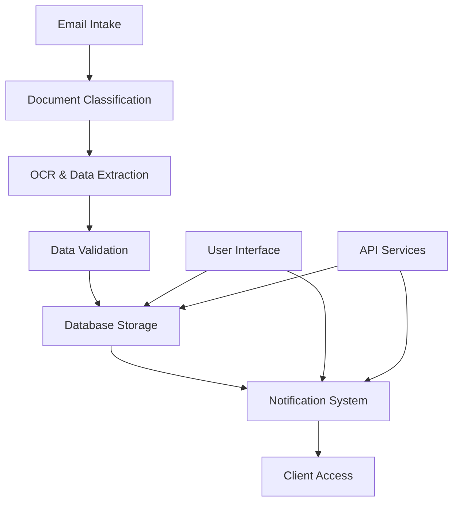

Key Components:

1. Email Processing System
   - Monitors submissions@dollarfunding.com
   - Extracts email metadata and attachments
   - Initiates the application processing workflow

2. Document Classification System
   - AI-powered classification of PDF attachments
   - Categorizes documents as ISO applications, bank statements, or voided checks
   - Utilizes Google Cloud Vision API for image analysis

3. Advanced OCR Solution
   - State-of-the-art OCR processing using Google Cloud Vision API
   - Handles imperfect scans and handwritten text
   - Extracts key information from various document types

4. Data Management System
   - Stores extracted data in Google Cloud Firestore
   - Implements data validation and error handling
   - Ensures data security and compliance with regulations

5. RESTful API
   - Built with Python and Flask
   - Provides endpoints for application retrieval and management
   - Supports webhook registration and management

6. UI Dashboard
   - Developed using React and Tailwind CSS
   - Displays application information and status
   - Offers webhook management interface

7. Webhook Notification System
   - Sends real-time updates on application status
   - Implements secure payload delivery and retry mechanisms

8. Security and Compliance System
   - Ensures data protection and regulatory adherence
   - Implements encryption, access controls, and audit logging

Technology Stack:

- Frontend: TypeScript, React, Tailwind CSS
- Backend: Python, Flask
- Database: Google Cloud Firestore
- Storage: Google Cloud Storage
- OCR: Google Cloud Vision API
- Infrastructure: Google Cloud Platform

The system is designed to be highly scalable, capable of handling a 200% increase in application volume, and maintains high availability with 99.99% uptime during business hours. It adheres to strict security standards and complies with relevant financial regulations, including GDPR and CCPA.

This automated solution will enable Dollar Funding to process MCA applications more efficiently, reducing the manual data entry team from 30 to 2 staff members, while improving accuracy and turnaround time for application processing.

## SYSTEM ARCHITECTURE

### PROGRAMMING LANGUAGES

The MCA application processing system will utilize the following programming languages:

1. TypeScript
   - Used for: Frontend development (React components)
   - Justification: Provides strong typing and enhanced tooling support for React development, improving code quality and maintainability.

2. Python
   - Used for: Backend services, API development, data processing
   - Justification: Excellent for rapid development, extensive library support for data processing and machine learning, and seamless integration with Google Cloud services.

3. SQL
   - Used for: Database queries and data manipulation
   - Justification: Standard language for interacting with relational databases, used in conjunction with Google Cloud Firestore's SQL-like query capabilities.

4. HTML/CSS
   - Used for: Frontend markup and styling
   - Justification: Essential for creating the structure and appearance of the web-based UI.

| Language   | Primary Use Case        | Justification                                                |
|------------|-------------------------|--------------------------------------------------------------|
| TypeScript | Frontend (React)        | Strong typing, enhanced tooling, improved maintainability    |
| Python     | Backend, API, Processing| Rapid development, extensive libraries, cloud integration    |
| SQL        | Database Operations     | Standard for data querying and manipulation                  |
| HTML/CSS   | Frontend Structure/Style| Essential for web-based UI development                       |

### HIGH-LEVEL ARCHITECTURE DIAGRAM

The following diagram provides an overview of the system's components and their interactions:

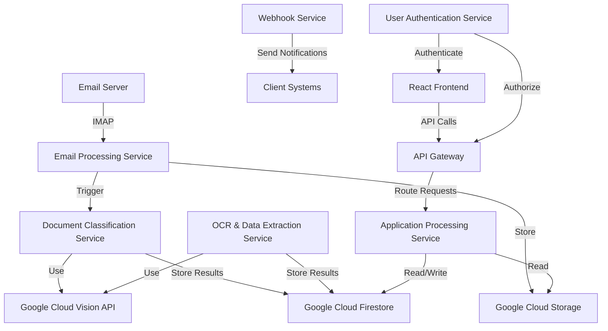

### COMPONENT DIAGRAMS

1. Frontend Components

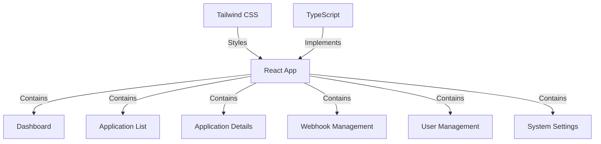

2. Backend Components

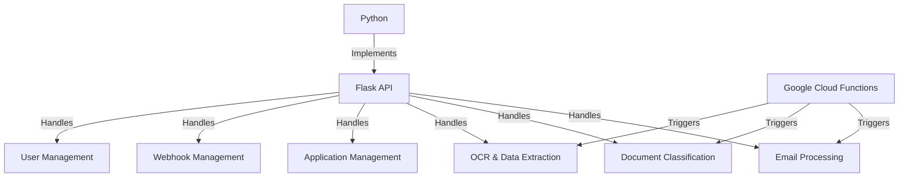

### SEQUENCE DIAGRAMS

1. Email Processing and Document Classification

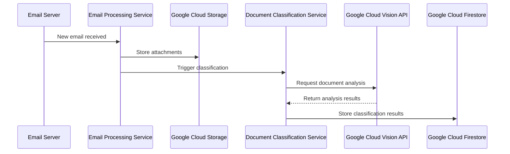

2. OCR and Data Extraction

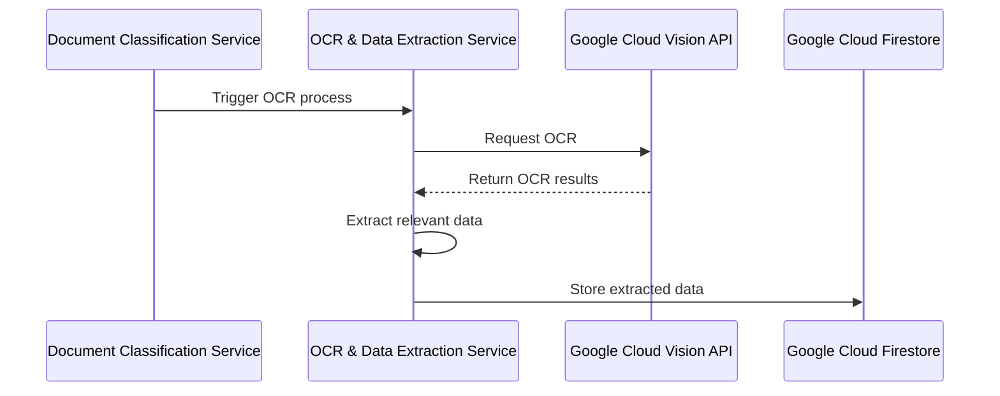

3. Webhook Notification

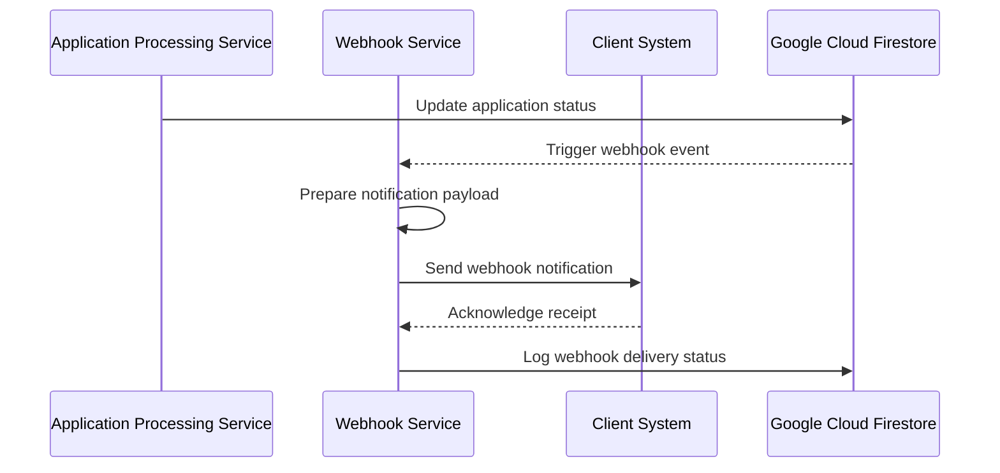

### DATA-FLOW DIAGRAM

The following diagram illustrates how information moves through the MCA application processing system:

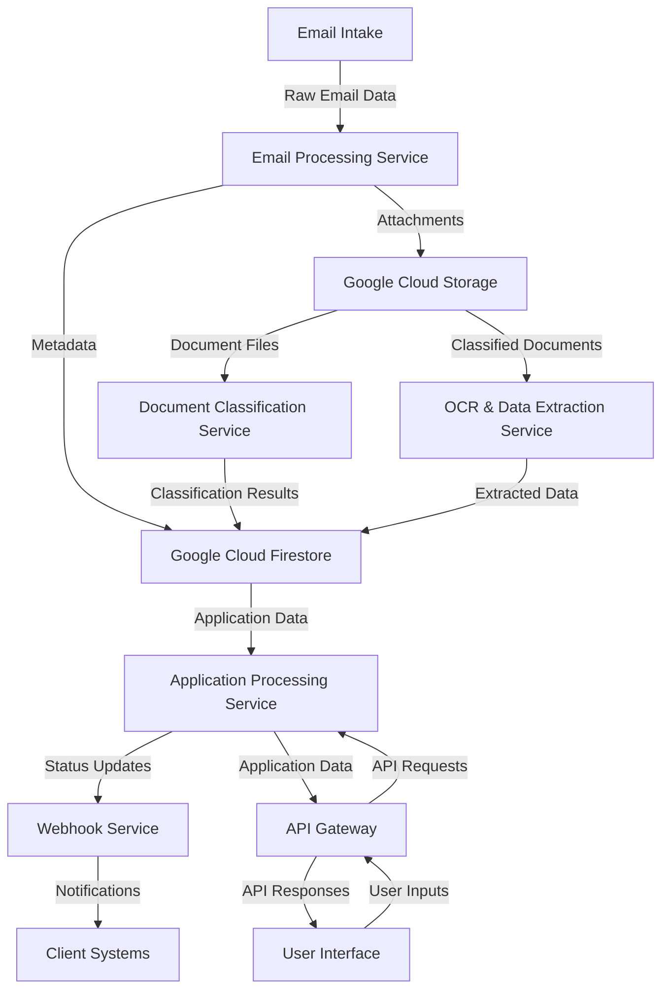

This data flow diagram shows the movement of information from the initial email intake through various processing stages, storage in Google Cloud services, and finally to the user interface and client systems. The system architecture leverages Google Cloud services for scalability and reliability, while using TypeScript and React for the frontend and Python for backend services, as specified in the project requirements.

## SYSTEM DESIGN

### PROGRAMMING LANGUAGES

The MCA application processing system will utilize the following programming languages:

1. TypeScript
   - Used for: Frontend development (React components)
   - Justification: Provides strong typing and enhanced tooling support for React development, improving code quality and maintainability.

2. Python
   - Used for: Backend services, API development, data processing
   - Justification: Excellent for rapid development, extensive library support for data processing and machine learning, and seamless integration with Google Cloud services.

3. SQL
   - Used for: Database queries and data manipulation
   - Justification: Standard language for interacting with relational databases, used in conjunction with Google Cloud Firestore's SQL-like query capabilities.

4. HTML/CSS
   - Used for: Frontend markup and styling
   - Justification: Essential for creating the structure and appearance of the web-based UI.

| Language   | Primary Use Case        | Justification                                                |
|------------|-------------------------|--------------------------------------------------------------|
| TypeScript | Frontend (React)        | Strong typing, enhanced tooling, improved maintainability    |
| Python     | Backend, API, Processing| Rapid development, extensive libraries, cloud integration    |
| SQL        | Database Operations     | Standard for data querying and manipulation                  |
| HTML/CSS   | Frontend Structure/Style| Essential for web-based UI development                       |

### DATABASE DESIGN

The MCA application processing system will use Google Cloud Firestore as the primary database. Firestore is a NoSQL document database that provides scalability, real-time updates, and strong consistency.

Database Structure:

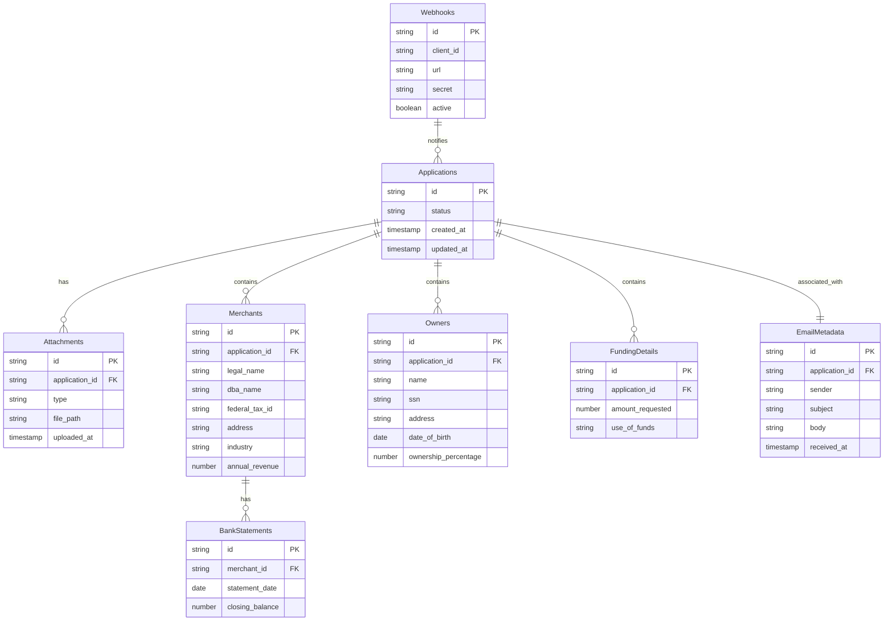

Indexing Strategy:
- Create composite indexes on frequently queried fields (e.g., application status and creation date)
- Use Firestore's automatic indexing for simple queries

Data Consistency:
- Utilize Firestore's strong consistency model for real-time updates
- Implement transactions for operations that require atomic updates across multiple documents

### API DESIGN

The MCA application processing system will expose a RESTful API for communication between the frontend and backend, as well as for integration with external systems.

API Structure:

1. Authentication
   - POST /api/auth/login
   - POST /api/auth/logout
   - POST /api/auth/refresh-token

2. Applications
   - GET /api/applications
   - GET /api/applications/{id}
   - POST /api/applications
   - PUT /api/applications/{id}
   - DELETE /api/applications/{id}

3. Attachments
   - GET /api/applications/{id}/attachments
   - POST /api/applications/{id}/attachments
   - DELETE /api/applications/{id}/attachments/{attachment_id}

4. Webhooks
   - GET /api/webhooks
   - POST /api/webhooks
   - PUT /api/webhooks/{id}
   - DELETE /api/webhooks/{id}

5. System
   - GET /api/system/status
   - GET /api/system/metrics

API Implementation:
- Use Flask and Flask-RESTful for API development in Python
- Implement JWT-based authentication for secure access
- Use Google Cloud API Gateway for API management and security

Example API Response:

```json
{
  "application": {
    "id": "12345",
    "status": "processing",
    "created_at": "2023-07-01T12:00:00Z",
    "updated_at": "2023-07-01T12:05:00Z",
    "merchant": {
      "legal_name": "ABC Corp",
      "dba_name": "ABC Solutions",
      "federal_tax_id": "12-3456789",
      "address": "123 Main St, Anytown, USA",
      "industry": "Technology",
      "annual_revenue": 1000000
    },
    "funding_details": {
      "amount_requested": 100000,
      "use_of_funds": "Equipment purchase"
    },
    "attachments": [
      {
        "id": "att-001",
        "type": "iso_application",
        "file_path": "gs://bucket-name/applications/12345/iso_application.pdf",
        "uploaded_at": "2023-07-01T12:01:00Z"
      }
    ]
  }
}
```

### USER INTERFACE DESIGN

The MCA application processing system will feature a web-based user interface developed using React and Tailwind CSS. The UI will be responsive and accessible, following modern design principles.

Key UI Components:

1. Dashboard
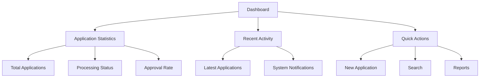

2. Application List
   - Sortable and filterable table of applications
   - Quick action buttons for common tasks
   - Pagination for large datasets

3. Application Details
   - Tabbed interface for different sections (Merchant Info, Funding Details, Attachments)
   - Inline editing for authorized users
   - Document viewer for attachments

4. Webhook Management
   - List of registered webhooks with status indicators
   - Form for adding/editing webhooks
   - Test button to verify webhook functionality

5. User Management
   - User list with role indicators
   - Role assignment interface
   - Access control matrix

UI Implementation:
- Use React for component-based development
- Implement Tailwind CSS for responsive and customizable styling
- Utilize React Router for navigation
- Implement React Query for efficient data fetching and caching

Example Dashboard Component:

```typescript
import React from 'react';
import { useQuery } from 'react-query';
import { fetchDashboardData } from '../api/dashboard';

const Dashboard: React.FC = () => {
  const { data, isLoading, error } = useQuery('dashboardData', fetchDashboardData);

  if (isLoading) return <div>Loading...</div>;
  if (error) return <div>Error fetching dashboard data</div>;

  return (
    <div className="p-6">
      <h1 className="text-2xl font-bold mb-4">Dashboard</h1>
      <div className="grid grid-cols-1 md:grid-cols-3 gap-4">
        <div className="bg-white p-4 rounded shadow">
          <h2 className="text-lg font-semibold mb-2">Total Applications</h2>
          <p className="text-3xl font-bold">{data.totalApplications}</p>
        </div>
        <div className="bg-white p-4 rounded shadow">
          <h2 className="text-lg font-semibold mb-2">Processing</h2>
          <p className="text-3xl font-bold">{data.processingApplications}</p>
        </div>
        <div className="bg-white p-4 rounded shadow">
          <h2 className="text-lg font-semibold mb-2">Approval Rate</h2>
          <p className="text-3xl font-bold">{data.approvalRate}%</p>
        </div>
      </div>
      {/* Add more dashboard components here */}
    </div>
  );
};

export default Dashboard;
```

This system design section provides a comprehensive overview of the programming languages, database structure, API design, and user interface components for the MCA application processing system. It leverages TypeScript, React, and Tailwind CSS for the frontend, Python for the backend, and Google Cloud services for the infrastructure, as specified in the project requirements.

## TECHNOLOGY STACK

### PROGRAMMING LANGUAGES

The MCA application processing system will utilize the following programming languages:

| Language   | Primary Use Case        | Justification                                                |
|------------|-------------------------|--------------------------------------------------------------|
| TypeScript | Frontend (React)        | Strong typing, enhanced tooling, improved maintainability    |
| Python     | Backend, API, Processing| Rapid development, extensive libraries, cloud integration    |
| SQL        | Database Operations     | Standard for data querying and manipulation                  |
| HTML/CSS   | Frontend Structure/Style| Essential for web-based UI development                       |

### FRAMEWORKS AND LIBRARIES

The following frameworks and libraries will be utilized in the development of the MCA application processing system:

1. Frontend:
   - React: JavaScript library for building user interfaces
   - Tailwind CSS: Utility-first CSS framework for rapid UI development
   - React Router: Declarative routing for React applications
   - React Query: Data fetching and state management library
   - Axios: Promise-based HTTP client for API requests

2. Backend:
   - Flask: Lightweight WSGI web application framework for Python
   - SQLAlchemy: SQL toolkit and Object-Relational Mapping (ORM) library
   - Celery: Distributed task queue for asynchronous processing
   - Pydantic: Data validation and settings management using Python type annotations
   - pytest: Testing framework for Python

3. OCR and Document Processing:
   - Tesseract: Open-source OCR engine
   - PyPDF2: PDF processing library for Python
   - Pillow: Python Imaging Library for image processing

4. Security:
   - PyJWT: JSON Web Token implementation for Python
   - bcrypt: Password hashing library
   - python-dotenv: Environment variable management

### DATABASES

The MCA application processing system will employ the following database solutions:

1. Primary Database:
   - Google Cloud Firestore: NoSQL document database for structured data storage
     - Justification: Scalability, real-time updates, and seamless integration with Google Cloud ecosystem

2. Caching Layer:
   - Redis: In-memory data structure store
     - Justification: High-performance caching, pub/sub messaging for real-time features

3. File Storage:
   - Google Cloud Storage: Object storage for unstructured data (e.g., PDF attachments)
     - Justification: Scalable, durable, and secure storage for large files

### THIRD-PARTY SERVICES

The following external services and APIs will be integrated into the MCA application processing system:

1. Google Cloud Services:
   - Google Cloud Vision API: For advanced OCR and document analysis
   - Google Cloud Natural Language API: For text analysis and entity extraction
   - Google Cloud Identity Platform: For user authentication and authorization
   - Google Cloud Pub/Sub: For message queuing and event-driven architecture
   - Google Cloud Monitoring and Logging: For system monitoring and log management

2. Email Services:
   - SendGrid: For transactional email delivery
   - Mailgun: As a backup email service provider

3. Payment Processing:
   - Stripe: For handling financial transactions and payment processing

4. Security and Compliance:
   - reCAPTCHA: For bot protection and form security
   - Sentry: For error tracking and performance monitoring
   - Cloudflare: For DDoS protection and content delivery network (CDN)

5. Analytics:
   - Google Analytics: For web analytics and user behavior tracking
   - Mixpanel: For product analytics and user engagement metrics

6. External Data Sources:
   - Plaid: For bank account verification and financial data aggregation
   - Experian Business: For business credit checks and verification

7. Collaboration and Communication:
   - Slack API: For internal notifications and alerts
   - Twilio: For SMS notifications and two-factor authentication

This technology stack leverages modern, scalable, and secure solutions, with a focus on the Google Cloud ecosystem as specified. The combination of TypeScript and React for the frontend, Python for the backend, and Google Cloud services for infrastructure provides a robust foundation for building the MCA application processing system.

## SECURITY CONSIDERATIONS

### AUTHENTICATION AND AUTHORIZATION

The MCA application processing system will implement a robust authentication and authorization mechanism to ensure secure access to the system and its resources.

1. Authentication:
   - Implement OAuth 2.0 using Google Cloud Identity Platform for user authentication
   - Enforce multi-factor authentication (MFA) for all user accounts
   - Use JSON Web Tokens (JWT) for maintaining authenticated sessions

2. Authorization:
   - Implement Role-Based Access Control (RBAC) using Google Cloud Identity and Access Management (IAM)
   - Define the following roles with associated permissions:

| Role | Permissions |
|------|-------------|
| Admin | Full system access, user management, configuration |
| Underwriter | View and process applications, access reports |
| Data Entry Specialist | Input and edit application data |
| Auditor | Read-only access to applications and system logs |
| API Client | Limited access to specific API endpoints |

3. Authentication Flow:

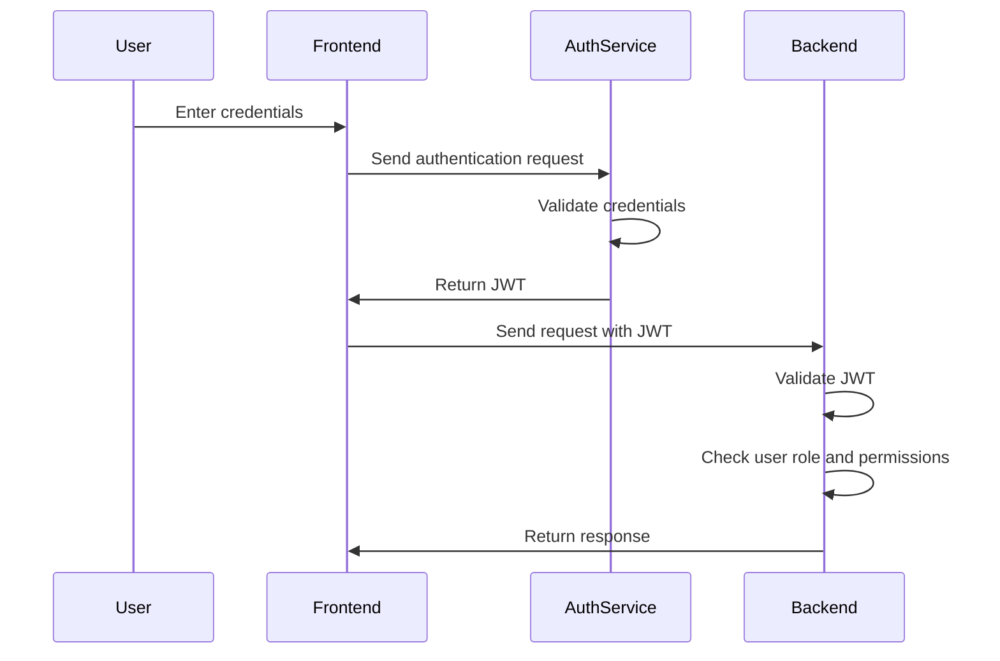

4. Implementation Details:
   - Use React Context API for managing authentication state in the frontend
   - Implement JWT validation middleware in the Python backend using PyJWT library
   - Store user roles and permissions in Google Cloud Firestore
   - Implement API key authentication for external API clients

### DATA SECURITY

To protect sensitive information processed by the MCA application processing system, the following data security measures will be implemented:

1. Encryption:
   - Use TLS 1.3 for all data in transit
   - Implement AES-256 encryption for data at rest in Google Cloud Storage and Firestore
   - Utilize Google Cloud Key Management Service (KMS) for managing encryption keys

2. Data Masking:
   - Apply data masking techniques for sensitive information (e.g., SSN, bank account numbers) in logs and non-production environments
   - Implement field-level encryption for highly sensitive data in Firestore

3. Access Controls:
   - Apply principle of least privilege for all system components and user roles
   - Implement Google Cloud Identity-Aware Proxy (IAP) for additional access control to backend services

4. Data Retention and Deletion:
   - Implement data retention policies in compliance with financial regulations (7 years for financial records)
   - Develop secure data deletion procedures for expired data or upon user request (GDPR compliance)

5. Secure File Handling:
   - Implement virus scanning for all uploaded files using Google Cloud Security Command Center
   - Generate and use signed URLs for temporary access to files in Google Cloud Storage

6. Database Security:
   - Enable Google Cloud Firestore security rules to enforce access control at the database level
   - Implement database connection pooling and prepared statements to prevent SQL injection attacks

7. Monitoring and Auditing:
   - Use Google Cloud Audit Logs to track all data access and modifications
   - Implement real-time alerting for suspicious activities using Google Cloud Security Command Center

### SECURITY PROTOCOLS

The following security protocols and standards will be implemented to maintain the overall security of the MCA application processing system:

1. Network Security:
   - Implement Google Cloud VPC (Virtual Private Cloud) for network isolation
   - Use Google Cloud Armor for protection against DDoS attacks and application-layer threats
   - Configure firewall rules to restrict access to only necessary ports and services

2. Application Security:
   - Conduct regular security code reviews and static code analysis
   - Implement Content Security Policy (CSP) headers in the frontend application
   - Use Google Cloud Web Security Scanner for automated vulnerability scanning

3. API Security:
   - Implement rate limiting and throttling to prevent API abuse
   - Use API keys or OAuth 2.0 tokens for all API requests
   - Validate and sanitize all input data to prevent injection attacks

4. Secure Development Lifecycle:
   - Follow OWASP Top 10 guidelines for secure application development
   - Implement automated security testing in the CI/CD pipeline
   - Conduct regular security training for development team members

5. Incident Response:
   - Develop and maintain an incident response plan
   - Implement automated alerting for security incidents using Google Cloud Security Command Center
   - Conduct regular security drills and tabletop exercises

6. Compliance:
   - Ensure compliance with PCI DSS for handling payment card information
   - Implement necessary controls for GDPR and CCPA compliance
   - Obtain and maintain SOC 2 Type II certification

7. Security Monitoring and Logging:
   - Centralize log collection using Google Cloud Logging
   - Implement real-time security monitoring using Google Cloud Security Command Center
   - Set up automated alerts for suspicious activities and potential security breaches

8. Patch Management:
   - Implement automated patch management for all system components
   - Conduct regular vulnerability assessments and penetration testing

9. Security Protocols Diagram:

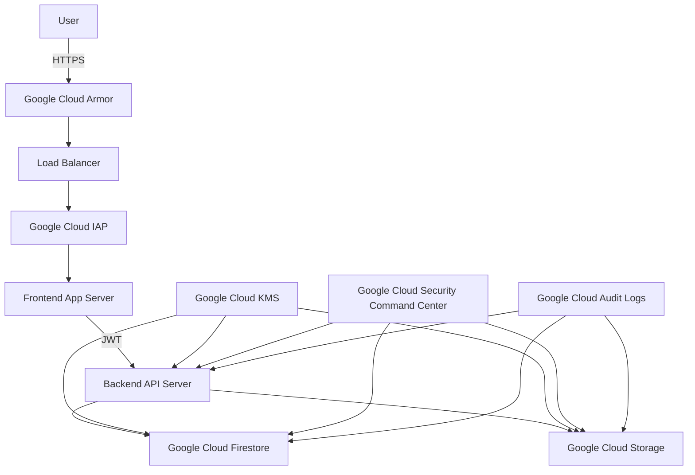

By implementing these security considerations, the MCA application processing system will maintain a high level of security, protecting sensitive financial information and ensuring compliance with relevant regulations. Regular security assessments and updates to these protocols will be necessary to address evolving threats and maintain the system's security posture.